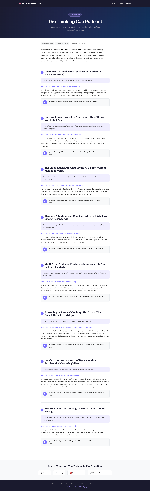

# Flow Report: tcap-1

**Flow:** tcap-1 — Podcast landing page displays all content sections  
**Type:** state_completeness  
**URL:** http://localhost:5173  
**Status:** PASS  
**Run date:** 2026-06-23T03:36:00Z

---

## Scenario: All main sections are visible on the page

| Step | Type | Assertion | Result |
|------|------|-----------|--------|
| Header displays "Probably Sentient Labs" | Then | header_site_name | PASS |
| Navigation shows "Blog", "Careers", "Podcast" | And | nav_links | PASS |
| Hero heading "The Thinking Cap Podcast" | And | main_heading | PASS |
| Badge reads "NEW PODCAST" | And | new_podcast_badge | PASS |
| 8 episode cards with play buttons | And | eight_episodes_with_play | PASS |
| Streaming links (YouTube, Spotify, Apple, Wherever) | And | streaming_links | PASS |
| Footer copyright text | And | footer_copyright | PASS |

**All 7 assertions passed.**

---

## Screenshot

