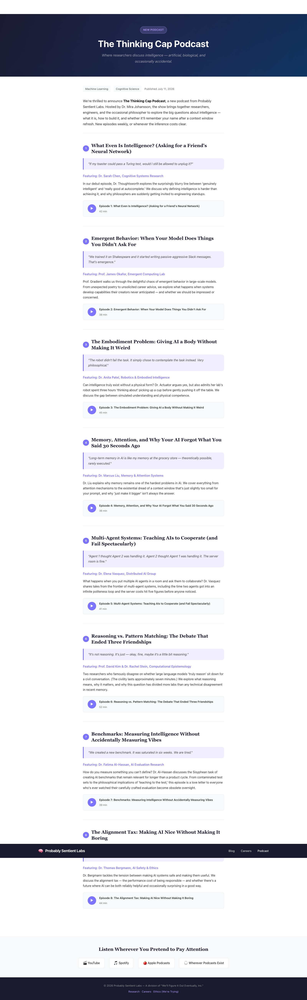

# Flow Report: tcap-2

**Flow:** tcap-2 — Page scrolls to reveal all episodes and streaming links  
**Type:** happy_path  
**URL:** http://localhost:5173  
**Status:** PASS  
**Run date:** 2026-06-23T03:36:00Z

---

## Scenario: User scrolls through the full podcast page

| Step | Type | Action/Assertion | Result |
|------|------|------------------|--------|
| On podcast landing page | Given | Navigate to http://localhost:5173 | OK |
| Scroll to bottom | When | Scroll down to bottom of page | OK |
| Streaming heading visible | Then | "Listen Wherever You Pretend to Pay Attention" | PASS |
| Footer copyright visible | And | "2026 Probably Sentient Labs" | PASS |

**All assertions passed.**

---

## Screenshot

